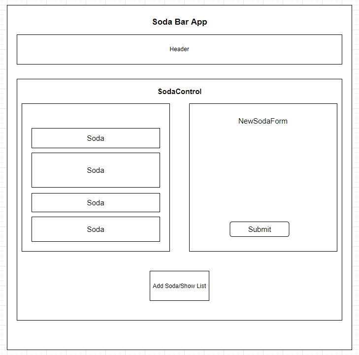
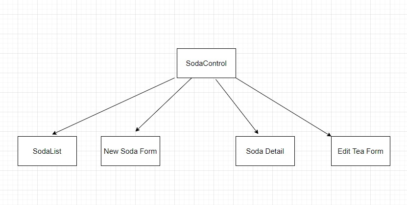

#### _Tap Room_

#### By _**Andre Velasquez**_

## Technologies Used

* _Git_
* _HTML_
* _CSS_
* _Bootstrap_
* _JavaScript_
* _npm_
* _webpack_
* _eslint_
* _React_

## Description
This is a Tap room where a Soda bar can track the cans!

It should have Create and Read Functionality.

## Plan/Component Diagram
Initial MVP that has CREATE and READ functionality

Final product with CRUD

## Setup/Installation Requirements
* Clone the Project
* cd into tap-room
* run `npm i` to install respective plugins/packages
* run `npm start` to go see a live server of the app

## Known Bugs

* _No known Bugs_

## License

*GNU GENERAL PUBLIC LICENSE
                       Version 3, 29 June 2007

 Copyright (C) 2007 Free Software Foundation, Inc. <http://fsf.org/>
 Everyone is permitted to copy and distribute verbatim copies
 of this license document, but changing it is not allowed.

 _{If you run into any problems, have any questions, or any ideas contact me!}_

 ## Contact Information
